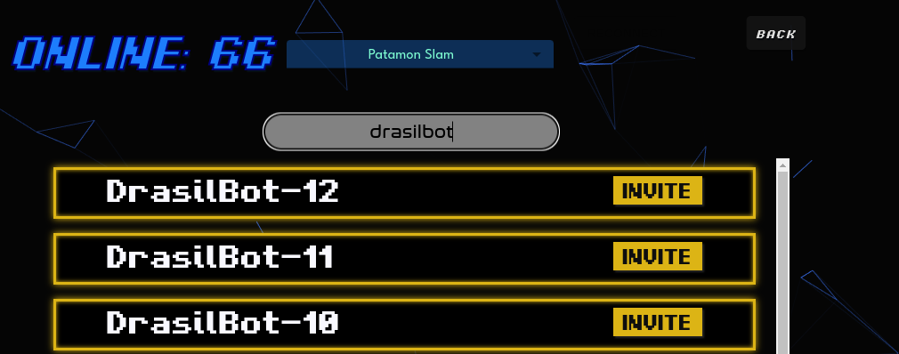

# Bot Guide

Drasil simulator supports playing against bots. 
Bots acts like players in the lobby.
Currently, the bot players are named *Drasilbot-X* where X is the id number. 
Bots will accept to play against you as soon as you invite any of them. 
If no bot shows on lobby then all bots are currently occupied.

The bots in Drasil are not completely automated.
It will resolve effects during its own turn. 
However, you will need to use the commands below to resolve effects that affect the bot's card. 
You can type the commands below directly in the game chat while playing against the bot.

The position X is identified in the following way on the field:

- **security check**: Perform a security check.

- **unsuspend X**: Suspend the card at the X position.

- **suspend X**: Suspend the card at the X position.

- **delete X**: Delete the card at the X position.

- **return bottom deck X**: Return the card at the X position at the bottom of the opponent deck.

- **return top deck X**: Return the card at the X position at the top of the opponent deck.

- **return hand X**: Return the card at the X position to the hand

- **trash digivolution card X Y**: Trash the Y digivolution card, starting from the bottom from the digimon/tamer at position X.

- **trash all digivolution cards X**: Trash all digivolution cards from the digimon/tamer at position X.

- **trash top security X**: Trash top card of opponent security stack.

- **trash bottom security X**: Trash bottom card of opponent security stack.

- **place top security X**: Place the digimon or Tamer at position X at the top of the security stack.

- **place bottom security X**: Place the digimon or Tamer at position X at the top of the security stack.

- **reveal security X**: Reveal the X card of opponent security, starting from the top.

- **draw X**: Draw X cards from deck.

- **reveal top deck**: Reveal the top card of the opponent deck.

- **trash top deck X**: Trash the top X cards of the opponent deck.

- **play reveal X**: Play card from the revealed cards at position X, starting from left.

- **trash reveal X**: Trash card from the revealed cards at position X, starting from left.

- **play trash X**: Play card from the trash at position X, starting from left.

- **stun X**: Make the digimon/tamer at position X unable to attack or block for the next turn.

- **cant attack X**: Make the digimon/tamer at position X unable to attack for the next turn.

- **cant block X**: Make the digimon/tamer at position X unable to block for the next turn.

- **cant unsuspend X**: Make the digimon/tamer at position X unable unsuspend.

- **cant suspend X**: Make the digimon/tamer at position X unable suspend.

- **de-digivolve X Y**: De-Digivolve Y the Digimon at position X.

- **collision X**: Force the bot to block the digimon X on your side (starting from left) with at least one digimon on its side.

- **start mp attack X**: Make the digimon at the X position gain "Start of main phase" digimon attacks".

- **discard hand random X**: Make the bot discard X cards at random

- **discard hand choose X**: Make the bot discard X cards to its own choice
